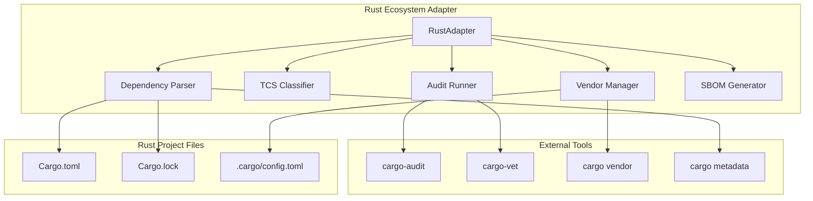

# Rust Ecosystem Adapter
## Architecture Design

## Overview

The Rust Ecosystem Adapter is a language-specific integration component of the Universal Supply-Chain Security System that translates Rust-ecosystem dependency management and security artifacts into the universal dependency model used by the Control Plane.

The adapter acts as an anti-corruption layer, isolating Rust-specific semantics from the Control Plane while enabling consistent security analysis, policy enforcement, auditing, and drift detection across multiple Rust projects. The adapter does not make security policy decisions; it produces normalized, verifiable data for consumption by the Control Plane.

## Architectural Principles

**Cargo.lock Authority**: Cargo.lock is the canonical source of dependency state. All other tools are advisory unless explicitly overridden by Control_Plane policy.

**Determinism and Reproducibility**: Identical inputs SHALL produce identical dependency graphs, SBOMs, and epoch identifiers.

**Offline-First Operation**: The Adapter SHALL support fully air-gapped execution using pre-fetched registries, git mirrors, and advisory databases.

**Policy Neutrality**: The Adapter gathers facts; the Control_Plane evaluates policy.

**Universal Graph Integrity**: The Universal Dependency Graph (UDG) MUST remain language-agnostic.

## Architecture

### Component Overview



### Core Components

| Component | Responsibility |
|-----------|----------------|
| Dependency Parser | Parse Cargo.lock and enrich via cargo metadata |
| Graph Builder | Construct UDG-compliant dependency graph |
| TCS Classifier | Deterministic toolchain classification |
| Audit Runner | Execute external Rust security tools |
| Vendor Manager | Vendor dependency sources |
| Artifact Emitters | Emit UDG, SBOM, audit artifacts |

#### 1. RustAdapter (Main Interface)
The primary struct implementing the `EcosystemAdapter` trait, coordinating all Rust-specific operations with strict adherence to architectural principles.

#### 2. Dependency Parser
Responsible for parsing Cargo.lock as the canonical authority and optionally enriching with cargo metadata. Uses Cargo.lock as the sole source of truth for dependency identity.

#### 3. TCS Classifier
Implements deterministic Trust-Critical Software classification using multi-signal heuristics with explicit precedence rules, avoiding opaque ML-based inference.

#### 4. Audit Runner
Orchestrates security auditing by executing cargo-audit and cargo-vet tools as external commands, capturing outputs verbatim without scoring or prioritization.

#### 5. Vendor Manager
Handles dependency vendoring operations with full offline support, including checksum verification and air-gapped operation capabilities.

#### 6. SBOM Generator
Creates standardized Software Bill of Materials in SPDX or CycloneDX formats without embedding vulnerability scoring.

## Components and Interfaces

### RustAdapter Implementation

```rust
pub struct RustAdapter {
    config: RustAdapterConfig,
    tool_paths: ToolPaths,
    logger: Logger,
    offline_mode: bool,
}

pub struct RustAdapterConfig {
    pub explicit_tcs_overrides: HashMap<String, TcsCategory>,
    pub custom_tcs_patterns: Vec<TcsPattern>,
    pub audit_timeout: Duration,
    pub vendor_timeout: Duration,
    pub sbom_format: SbomFormat,
    pub offline_mode: bool,
    pub schema_validation: bool,
}

pub struct ToolPaths {
    pub cargo: PathBuf,
    pub cargo_audit: Option<PathBuf>,
    pub cargo_vet: Option<PathBuf>,
}

impl EcosystemAdapter for RustAdapter {
    fn ecosystem_name(&self) -> &str { "rust" }
    
    fn supported_lockfile_formats(&self) -> Vec<&str> {
        vec!["Cargo.lock"]
    }
    
    async fn parse_dependencies(&self, project: &Project) -> Result<DependencyGraph> {
        // Implementation follows Cargo.lock authority principle
    }
    
    // ... other trait methods
}
```

### Dependency Resolution Strategy

The adapter uses a strict Cargo.lock-first approach:

1. **Cargo.lock Parsing**: Parse Cargo.lock as the sole authority for dependency identity
2. **Metadata Enrichment (Advisory Only)**: Optionally enrich with cargo metadata for dependency kinds and features
3. **Conflict Resolution**: In case of divergence, Cargo.lock prevails with warnings emitted
4. **Graph Construction**: Build UDG-compliant dependency graph preserving exact lockfile identity

```rust
pub struct DependencyResolver {
    offline_mode: bool,
}

impl DependencyResolver {
    pub fn resolve_from_lockfile(&self, lockfile_path: &Path) -> Result<DependencyGraph> {
        // 1. Parse Cargo.lock as canonical source
        let lockfile = self.parse_cargo_lock(lockfile_path)?;
        
        // 2. Build base graph from lockfile entries only
        let mut graph = self.build_base_graph(&lockfile)?;
        
        // 3. Optionally enrich with metadata (advisory only)
        if !self.offline_mode {
            if let Ok(metadata) = self.fetch_cargo_metadata() {
                self.enrich_graph(&mut graph, &metadata)?;
            }
        }
        
        // 4. Validate UDG compliance
        self.validate_udg_schema(&graph)?;
        
        Ok(graph)
    }
}
```

### Universal Dependency Graph (UDG) Construction

The adapter constructs UDG-compliant graphs with Rust-specific annotations:

```rust
pub struct UdgNode {
    pub base: PackageNode,
    pub annotations: Vec<Annotation>,
}

pub struct Annotation {
    pub namespace: String, // "rust"
    pub key: String,       // "cargo"
    pub value: serde_json::Value,
}

// Rust-specific annotations (UDG-safe)
pub struct RustAnnotation {
    pub features: Vec<String>,
    pub dependency_kind: DependencyKind, // normal, build, dev
    pub target_specific: bool,
    pub proc_macro: bool,
}
```

### TCS Classification Logic

The TCS classifier uses deterministic, multi-signal heuristics:

```rust
pub struct TcsClassifier {
    explicit_overrides: HashMap<String, TcsCategory>,
    patterns: Vec<TcsPattern>,
    signals: Vec<ClassificationSignal>,
}

pub enum ClassificationSignal {
    ExplicitOverride(String),
    DependencyKind(DependencyKind),
    BuildScriptUsage,
    ProcMacroUsage,
    NamePattern(String),
    CargoCategory(String),
    CargoKeyword(String),
}

impl TcsClassifier {
    pub fn classify_crate(&self, package: &CargoPackage) -> ClassificationResult {
        let mut signals = Vec::new();
        
        // 1. Check explicit overrides (highest precedence)
        if let Some(category) = self.explicit_overrides.get(&package.name) {
            signals.push(ClassificationSignal::ExplicitOverride(package.name.clone()));
            return ClassificationResult::Tcs(*category, signals);
        }
        
        // 2. Check dependency role
        if package.is_proc_macro {
            signals.push(ClassificationSignal::ProcMacroUsage);
            return ClassificationResult::Tcs(TcsCategory::BuildTimeExecution, signals);
        }
        
        // 3. Apply pattern matching
        for pattern in &self.patterns {
            if pattern.matches(&package.name) {
                signals.push(ClassificationSignal::NamePattern(pattern.regex.to_string()));
                return ClassificationResult::Tcs(pattern.category, signals);
            }
        }
        
        // 4. Default to Mechanical
        ClassificationResult::Mechanical(signals)
    }
}

pub struct ClassificationResult {
    pub role: ToolchainRole,
    pub signals: Vec<ClassificationSignal>,
}

pub enum ToolchainRole {
    Tcs(TcsCategory),
    Mechanical,
}

pub enum TcsCategory {
    Cryptography,
    Authentication,
    Serialization,
    Transport,
    Random,
    BuildTimeExecution, // New category for proc-macros and build.rs
}
```

### Audit Integration

The audit runner coordinates multiple security tools with strict separation of concerns:

```rust
pub struct AuditRunner {
    cargo_audit_path: Option<PathBuf>,
    cargo_vet_path: Option<PathBuf>,
    timeout: Duration,
    offline_mode: bool,
}

impl AuditRunner {
    pub async fn run_comprehensive_audit(&self, project: &Project) -> Result<AuditReport> {
        let mut report = AuditReport::new();
        
        // Run cargo-audit for vulnerability scanning (external command)
        if let Some(audit_results) = self.run_cargo_audit(project).await? {
            report.raw_audit_output = audit_results;
        }
        
        // Run cargo-vet for supply chain auditing (external command)
        if let Some(vet_results) = self.run_cargo_vet(project).await? {
            report.raw_vet_output = vet_results;
        }
        
        // DO NOT score, prioritize, or suppress tool output
        Ok(report)
    }
    
    async fn run_cargo_audit(&self, project: &Project) -> Result<Option<String>> {
        if self.offline_mode {
            // Use locally cached advisory database
            self.run_offline_audit(project).await
        } else {
            // Execute: cargo audit --json --file path/to/Cargo.lock
            // Capture output verbatim
            self.execute_external_tool("cargo-audit", &["audit", "--json"]).await
        }
    }
    
    async fn run_cargo_vet(&self, project: &Project) -> Result<Option<String>> {
        // Execute: cargo vet --output-format json
        // Capture audit status verbatim - no interpretation
        self.execute_external_tool("cargo-vet", &["vet", "--output-format", "json"]).await
    }
}

pub struct AuditReport {
    pub raw_audit_output: Option<String>,
    pub raw_vet_output: Option<String>,
    pub execution_metadata: AuditExecutionMetadata,
}

pub struct AuditExecutionMetadata {
    pub timestamp: DateTime<Utc>,
    pub tool_versions: HashMap<String, String>,
    pub offline_mode: bool,
    pub execution_duration: Duration,
}
```

**Key Principles**:
- Tools are executed as external commands
- Outputs are captured verbatim
- No scoring, prioritization, or suppression
- Offline mode uses locally cached databases
- All outputs are emitted as separate artifacts

### Vendoring Strategy

The vendor manager handles offline dependency management with full air-gap support:

```rust
pub struct VendorManager {
    vendor_timeout: Duration,
    offline_mode: bool,
}

impl VendorManager {
    pub async fn vendor_dependencies(&self, project: &Project, target: &Path) -> Result<VendorInfo> {
        // 1. Execute cargo vendor <target_dir>
        let vendor_result = self.execute_cargo_vendor(project, target).await?;
        
        // 2. Verify all dependencies from Cargo.lock are present
        self.verify_lockfile_completeness(project, target).await?;
        
        // 3. Validate checksums against Cargo.lock (mandatory)
        self.validate_checksums(project, target).await?;
        
        // 4. Generate .cargo/config.toml for offline builds
        self.generate_cargo_config(target).await?;
        
        // 5. Compute cryptographic digest of vendor directory
        let vendor_digest = self.compute_vendor_digest(target).await?;
        
        Ok(VendorInfo {
            vendor_path: target.to_path_buf(),
            total_packages: vendor_result.package_count,
            vendor_digest,
            offline_ready: true,
        })
    }
    
    pub async fn verify_vendored(&self, project: &Project, vendored: &Path) -> Result<VerificationReport> {
        let mut report = VerificationReport::new();
        
        // 1. Check vendor directory structure
        report.structure_valid = self.validate_vendor_structure(vendored).await?;
        
        // 2. Verify checksums against Cargo.lock (critical)
        report.checksum_mismatches = self.find_checksum_mismatches(project, vendored).await?;
        
        // 3. Validate .cargo/config.toml configuration
        report.config_valid = self.validate_cargo_config(vendored).await?;
        
        // 4. Ensure all dependencies are present
        report.missing_dependencies = self.find_missing_dependencies(project, vendored).await?;
        
        // Checksum mismatch invalidates entire epoch
        if !report.checksum_mismatches.is_empty() {
            report.epoch_valid = false;
        }
        
        Ok(report)
    }
}

pub struct VendorInfo {
    pub vendor_path: PathBuf,
    pub total_packages: usize,
    pub vendor_digest: String,
    pub offline_ready: bool,
}

pub struct VerificationReport {
    pub structure_valid: bool,
    pub checksum_mismatches: Vec<ChecksumMismatch>,
    pub config_valid: bool,
    pub missing_dependencies: Vec<String>,
    pub epoch_valid: bool,
}

pub struct ChecksumMismatch {
    pub package_name: String,
    pub expected_checksum: String,
    pub actual_checksum: String,
}
```

**Offline Operation Guarantees**:
- No network access required when offline_mode = true
- All operations rely solely on local artifacts
- Missing artifacts cause deterministic failure
- Checksum mismatches invalidate entire epoch

## Data Models

### Universal Dependency Graph Mapping

```rust
// UDG-compliant node with Rust-specific annotations
pub struct RustPackageNode {
    pub base: PackageNode, // Universal schema
    pub annotations: Vec<RustAnnotation>,
}

pub struct RustAnnotation {
    pub namespace: String, // Always "rust"
    pub key: String,       // "cargo", "features", etc.
    pub value: serde_json::Value,
}

// Rust-specific metadata (stored in annotations)
pub struct CargoMetadata {
    pub manifest_path: PathBuf,
    pub edition: String,
    pub rust_version: Option<String>,
    pub categories: Vec<String>,
    pub keywords: Vec<String>,
    pub features: Vec<String>,
    pub dependency_kind: DependencyKind,
    pub proc_macro: bool,
}

pub enum DependencyKind {
    Normal,
    Build,
    Dev,
}
```

### Audit Report Structure

```rust
pub struct RustAuditReport {
    pub raw_cargo_audit: Option<String>,
    pub raw_cargo_vet: Option<String>,
    pub execution_metadata: AuditExecutionMetadata,
    pub offline_mode: bool,
}

// Raw tool outputs - no interpretation or scoring
pub struct AuditExecutionMetadata {
    pub timestamp: DateTime<Utc>,
    pub tool_versions: HashMap<String, String>,
    pub execution_duration: Duration,
    pub exit_codes: HashMap<String, i32>,
}
```

### SBOM Generation

The adapter supports both SPDX and CycloneDX formats without vulnerability scoring:

```rust
pub enum SbomFormat {
    SpdxJson,
    CycloneDxJson,
}

pub struct SbomGenerator {
    format: SbomFormat,
    include_dev_dependencies: bool,
}

impl SbomGenerator {
    pub fn generate_sbom(&self, project: &Project, dependencies: &DependencyGraph) -> Result<String> {
        match self.format {
            SbomFormat::SpdxJson => self.generate_spdx(project, dependencies),
            SbomFormat::CycloneDxJson => self.generate_cyclonedx(project, dependencies),
        }
    }
    
    fn generate_spdx(&self, project: &Project, dependencies: &DependencyGraph) -> Result<String> {
        // Generate SPDX 2.3 JSON format
        // Include package information, licenses, relationships
        // NO vulnerability scoring or security metadata
    }
    
    fn generate_cyclonedx(&self, project: &Project, dependencies: &DependencyGraph) -> Result<String> {
        // Generate CycloneDX 1.4 JSON format
        // Component-only SBOM without vulnerability data
        // Security metadata handled by Control Plane
    }
}
```

### Artifact Outputs

The adapter emits standardized artifacts:

| Artifact | Description | Format |
|----------|-------------|---------|
| UDG JSON | Universal dependency graph | JSON Schema compliant |
| SBOM | Component-only bill of materials | SPDX/CycloneDX |
| Audit Logs | Raw outputs from audit tools | JSON/Text |
| Vendor Manifest | Vendoring metadata and checksums | JSON |

**Key Principle**: SBOMs SHALL NOT embed vulnerability scoring - this is Control Plane responsibility.

Now I need to use the prework tool to analyze the acceptance criteria before writing the correctness properties:

## Correctness Properties

*A property is a characteristic or behavior that should hold true across all valid executions of a system—essentially, a formal statement about what the system should do. Properties serve as the bridge between human-readable specifications and machine-verifiable correctness guarantees.*

### Property 1: Deterministic Output (CP-1)
*For any* identical inputs (source tree, Cargo.lock, configuration), the adapter should produce byte-identical outputs across repeated runs.
**Validates: Requirements 1.1, 1.2, 1.3**

### Property 2: Cargo.lock Authority (CP-2)
*For any* dependency in the UDG, it should be present in Cargo.lock, and no dependency should appear in the UDG unless it exists in Cargo.lock.
**Validates: Requirements 1.1, 1.2**

### Property 3: Identity Integrity (CP-3)
*For any* dependency node in the UDG, it should preserve the exact name, version, source, and checksum specified in Cargo.lock.
**Validates: Requirements 1.2, 1.3**

### Property 4: Git Dependency Extraction
*For any* Rust project containing git dependencies, the adapter should extract repository URL, commit hash, and branch/tag information for all git-sourced packages.
**Validates: Requirements 1.4**

### Property 5: Local Path Dependency Validation
*For any* Rust project with local path dependencies, the adapter should record relative paths and validate that all referenced dependencies exist on the filesystem.
**Validates: Requirements 1.5**

### Property 6: Classification Explainability (CP-4)
*For any* ToolchainRole assignment, it should include at least one explicit classification signal, ensuring all classifications are auditable and explainable.
**Validates: Requirements 2.1, 2.2, 2.3, 2.4, 2.5, 2.6, 2.7**

### Property 7: Custom TCS Configuration Override
*For any* project with custom TCS categories configured, the adapter should apply project-specific classifications with explicit overrides taking precedence over default rules.
**Validates: Requirements 2.8**

### Property 8: Offline Safety (CP-5)
*For any* operation in offline mode, the adapter should not perform network I/O and should operate solely on local artifacts.
**Validates: Requirements 3.1, 3.2**

### Property 9: Audit Tool Output Preservation
*For any* audit operation, the adapter should capture tool outputs verbatim without scoring, prioritization, or suppression.
**Validates: Requirements 3.3, 3.4**

### Property 10: Audit Error Handling
*For any* audit operation that fails, the adapter should return structured error information with stable error codes and actionable guidance.
**Validates: Requirements 3.5**

### Property 11: Vendoring Integrity (CP-6)
*For any* vendoring operation, checksum mismatches should invalidate the entire epoch, and all dependencies from Cargo.lock should be present with correct checksums.
**Validates: Requirements 4.1, 4.2, 4.3**

### Property 12: Git Dependency Vendoring Verification
*For any* Rust project with git dependencies, vendoring should ensure the exact commit specified in Cargo.lock is vendored and verifiable.
**Validates: Requirements 4.4**

### Property 13: Vendoring Error Reporting
*For any* vendoring operation that fails, the adapter should provide clear error messages indicating which specific dependencies could not be vendored and why.
**Validates: Requirements 4.5, 4.6**

### Property 14: Schema Stability (CP-7)
*For any* generated UDG, Rust-specific data should not alter the Universal Dependency Graph schema and should be stored in namespaced annotations.
**Validates: Requirements 5.1**

### Property 15: Complete SBOM Content
*For any* generated SBOM, it should include complete information for all dependencies (name, version, source, licenses) without vulnerability scoring, with proper metadata and special handling for git dependencies.
**Validates: Requirements 5.2, 5.3, 5.4, 5.5, 5.6**

### Property 16: Comprehensive Drift Detection
*For any* epoch comparison, the adapter should identify all changes (additions, removals, version changes, source changes) and categorize them correctly with appropriate priority levels based on TCS classification.
**Validates: Requirements 6.1, 6.2, 6.3, 6.4, 6.5, 6.6**

### Property 16b: Source Drift Detection
*For any* dependency whose version remains constant but whose source changes (e.g., registry → git), the adapter should flag this as high-risk drift indicating potential supply-chain attack.
**Validates: Requirements 6.4**

### Property 17: Configuration Validation and Defaults
*For any* project configuration (valid, invalid, or missing), the adapter should validate against a published schema, apply custom configurations when valid, and fall back to sensible defaults with appropriate warnings.
**Validates: Requirements 7.1, 7.2, 7.3, 7.4, 7.5, 7.6**

### Property 18: Structured Error Handling
*For any* operation failure, the adapter should return structured error information with stable error codes, descriptions, and context-specific guidance.
**Validates: Requirements 8.1, 8.2, 8.3, 8.4**

### Property 19: Comprehensive Logging
*For any* operation when logging is enabled, the adapter should record major operations with timestamps and context, with debug logging providing detailed information about tool execution and file parsing.
**Validates: Requirements 8.5, 8.6**

## Error Handling

The Rust Ecosystem Adapter implements comprehensive error handling with stable error codes and structured responses:

### Error Categories

1. **Tool Execution Errors**: Missing cargo tools, execution failures, timeout errors
2. **File System Errors**: Missing files, permission issues, invalid paths  
3. **Parsing Errors**: Malformed Cargo.toml/Cargo.lock, invalid JSON output
4. **Network Errors**: Registry connectivity issues, git clone failures (offline mode prevents these)
5. **Configuration Errors**: Invalid settings, missing required fields, schema validation failures
6. **Integrity Errors**: Checksum mismatches, vendor verification failures

### Error Response Structure

```rust
pub struct AdapterError {
    pub code: ErrorCode,
    pub message: String,
    pub context: ErrorContext,
    pub suggestions: Vec<String>,
    pub recoverable: bool,
}

pub enum ErrorCode {
    // Tool errors
    ToolNotFound,
    ToolExecutionFailed,
    ToolTimeout,
    
    // File system errors
    FileNotFound,
    PermissionDenied,
    InvalidPath,
    
    // Parsing errors
    CargoLockParseError,
    CargoTomlParseError,
    MetadataParseError,
    
    // Network errors (offline mode prevents these)
    NetworkTimeout,
    RegistryUnavailable,
    
    // Configuration errors
    ConfigurationInvalid,
    SchemaValidationFailed,
    
    // Integrity errors
    ChecksumMismatch,
    VendorVerificationFailed,
    EpochInvalidated,
}

pub struct ErrorContext {
    pub operation: String,
    pub file_path: Option<PathBuf>,
    pub tool_command: Option<String>,
    pub exit_code: Option<i32>,
    pub stderr: Option<String>,
    pub offline_mode: bool,
}
```

### Recovery Strategies

- **Tool Missing**: Provide installation instructions for cargo-audit, cargo-vet with platform-specific guidance
- **Network Failures**: In online mode, suggest retry with exponential backoff; recommend offline mode for air-gapped environments
- **Permission Errors**: Suggest file permission fixes, alternative paths, or running with appropriate privileges
- **Parse Failures**: Validate input files, suggest format corrections, provide schema references
- **Checksum Mismatches**: Invalidate epoch immediately, suggest re-vendoring, alert to potential supply chain attack
- **Configuration Errors**: Provide schema validation details, suggest corrections, fall back to defaults with warnings

### Offline Mode Error Handling

In offline mode, network-related errors are prevented rather than handled:
- Registry access attempts are blocked at the adapter level
- Git clone operations use local mirrors only
- Advisory database queries use cached data
- Missing local artifacts cause deterministic failure with clear guidance

## Testing Strategy

The Rust Ecosystem Adapter requires comprehensive testing using both unit tests and property-based tests to ensure correctness across the wide variety of Rust project configurations and to validate the architectural principles.

### Property-Based Testing

Property-based tests will validate universal properties across many generated inputs using a Rust property testing library (proptest). Each property test will run a minimum of 100 iterations to ensure comprehensive coverage.

**Test Configuration**:
- Library: `proptest` (preferred for Rust ecosystem)
- Iterations: 100 minimum per property test
- Timeout: 30 seconds per property test
- Shrinking: Enabled for counterexample minimization

**Property Test Implementation**:
Each correctness property will be implemented as a separate property-based test with the following tag format:
```rust
// Feature: rust-ecosystem-adapter, Property 1: Deterministic Output
```

**Test Data Generation**:
- **Valid Cargo Projects**: Generate realistic Cargo.toml/Cargo.lock combinations following Cargo.lock authority
- **Dependency Variations**: Registry, git, local path dependencies with various configurations
- **TCS Crate Samples**: Known cryptographic, authentication, serialization crates for classification testing
- **Error Scenarios**: Invalid files, missing tools, network failures, checksum mismatches
- **Configuration Variants**: Valid, invalid, and missing configuration files with schema validation
- **Offline Mode Testing**: All operations with network disabled to validate offline safety

### Unit Testing

Unit tests will focus on specific examples, edge cases, and integration points:

**Core Unit Tests**:
- Cargo.lock parsing with specific dependency configurations (authority principle validation)
- TCS classification for known crate categories with explainable signals
- Tool execution with mocked command outputs (offline mode simulation)
- SBOM generation with sample projects (no vulnerability scoring)
- Error handling with specific failure scenarios and stable error codes
- Schema validation for UDG compliance

**Integration Tests**:
- End-to-end workflows with real Rust projects in both online and offline modes
- Tool integration with actual cargo-audit, cargo-vet execution
- File system operations with temporary directories and permission testing
- Configuration loading with various file formats and schema validation
- Vendoring operations with checksum verification and integrity validation

**Edge Case Testing**:
- Empty projects with no dependencies
- Projects with circular dependencies (should be prevented by Cargo.lock authority)
- Large projects with hundreds of dependencies
- Projects with mixed dependency sources (registry + git + local)
- Malformed or corrupted Cargo.lock files
- Checksum mismatches during vendoring (epoch invalidation)
- Network failures in online mode vs. offline mode behavior

### Architectural Principle Validation

**Determinism Testing**:
- Run identical inputs multiple times, verify byte-identical outputs
- Test across different environments and timestamps
- Validate that offline mode produces identical results

**Cargo.lock Authority Testing**:
- Test scenarios where cargo metadata contradicts Cargo.lock
- Verify Cargo.lock always takes precedence
- Validate warnings are emitted for divergence

**Offline Safety Testing**:
- Execute all operations with network disabled
- Verify no network I/O attempts in offline mode
- Test graceful degradation when network resources unavailable

**Schema Stability Testing**:
- Validate UDG output against canonical schema
- Ensure Rust annotations don't break universal schema
- Test Control Plane can safely ignore Rust-specific data

### Test Environment Setup

```rust
// Test utilities for generating valid Rust projects
pub struct TestProjectBuilder {
    dependencies: Vec<TestDependency>,
    git_dependencies: Vec<TestGitDependency>,
    local_dependencies: Vec<TestLocalDependency>,
    features: Vec<String>,
    offline_mode: bool,
}

impl TestProjectBuilder {
    pub fn with_registry_dep(mut self, name: &str, version: &str) -> Self { /* ... */ }
    pub fn with_git_dep(mut self, name: &str, repo: &str, rev: &str) -> Self { /* ... */ }
    pub fn with_local_dep(mut self, name: &str, path: &str) -> Self { /* ... */ }
    pub fn with_offline_mode(mut self, offline: bool) -> Self { /* ... */ }
    pub fn build_in_tempdir(self) -> TempProject { /* ... */ }
}

// Test utilities for validating architectural principles
pub struct ArchitecturalValidator;

impl ArchitecturalValidator {
    pub fn validate_determinism(inputs: &ProjectInputs) -> Result<()> { /* ... */ }
    pub fn validate_cargo_lock_authority(project: &TempProject) -> Result<()> { /* ... */ }
    pub fn validate_offline_safety(adapter: &RustAdapter) -> Result<()> { /* ... */ }
    pub fn validate_schema_stability(udg: &DependencyGraph) -> Result<()> { /* ... */ }
}
```

### Continuous Integration

The testing strategy integrates with CI/CD pipelines:

- **Pre-commit**: Fast unit tests and basic property tests, architectural principle validation
- **Pull Request**: Full test suite including all property tests and offline mode testing
- **Nightly**: Extended property testing with increased iteration counts, large project testing
- **Release**: Comprehensive integration testing with real-world projects, schema validation

This dual testing approach ensures both specific correctness (unit tests) and general correctness (property tests), while validating adherence to architectural principles that make the adapter suitable for high-assurance environments.